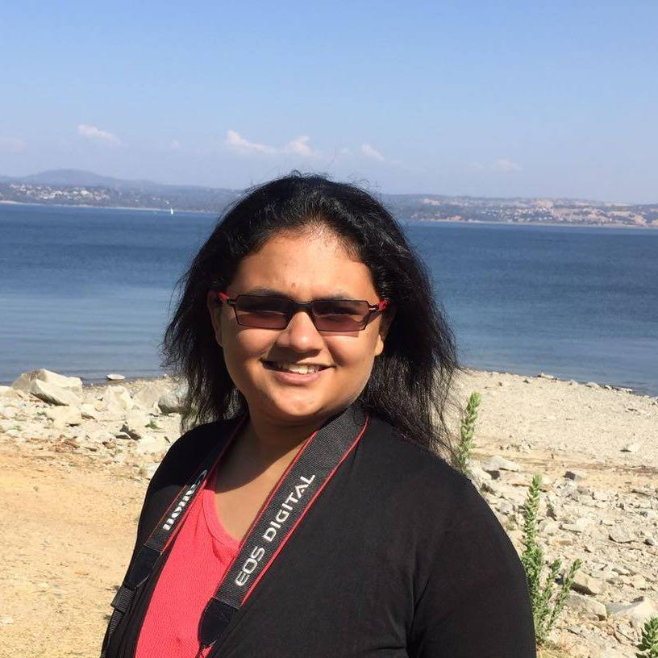

# Debasmita Ghose

## [Projects](https://debasmitaghose.github.io/Projects/) | [CV](https://debasmitaghose.github.io/CV/) | [Robots](https://debasmitaghose.github.io/Robots/)

I am a graduate student of Computer Science at University of Massachusetts, Amherst. I am working as a Graduate Research Assistant on my Masters Thesis at [Laboratory for Perceptual Robotics](https://www-robotics.cs.umass.edu/), under [Prof. Rod Grupen](http://www-robotics.cs.umass.edu/~grupen/home.html). My areas of interest are Robotics, Computer Vision and Embedded System Design. I have always been a curious person and my curiosity always made me ponder how things can work better. During my undergraduate studies at Manipal Institute of Technology, India, I have built the protoypes of various systems, that can help people lead better lives, through my skills in Embedded Systems Design. I have enjoyed working at Technical University of Dresden, Germany, Nanyang Technological University, Singapore and Siemens Corporate Technology, Munich, Germany. 

I have been involved in projects in the domain of Robotics,  Ubiquitous Computing,  Machine Learning and Deep Learning for Computer Vision. I am particularly interested in the manipulation and control of robots in chaotic environments and design of UAVs.

Besides incessantly wanting to learn more every day, I am greatly drawn towards travelling, photography and cooking. 

### News

- **April 2019 -** Will start working towards a Ph.D. in Computer Science at Yale University from Fall 2019 advised by [Brian Scassellati](http://cs-www.cs.yale.edu/homes/scaz/) and [Marynel Vazquez](http://www.marynel.net/) at the [Yale Social Robotics Lab](https://scazlab.yale.edu/)
- **April 2019 -** Our paper [***Pedestrian Detection in Thermal Images using Saliency Maps***](https://arxiv.org/abs/1904.06859?context=cs) accepted to the IEEE Workshop on Perception Beyond the Visible Spectrum at CVPR, 2019 (Long Beach, California).
- **Summer 2018 -** Received the DAAD RISE Professional Scholarship - 2018 to pursue a research internship with Siemens CT, Munich, Germany
- **Fall 2017 -** Started Masters in Computer Science at University of Massachsetts, Amherst 
- **Spring 2017 -** Selected for a research internship at Nanyang Technological University, Singapore through the NTU India Connect Program 
- **October 2016 -** Received the Best Student Award for the Batch of 2013-2017, from the Department of Electronics and Communication Engineering, Manipal Institute of Technology, India
- **Summer 2016 -** Selected for a summer internship at Techniche Universitat, Dresden, Germany
- **April 2016 -** Our project ***Road Accident Prevention System*** was one of the top 10 finalists at the Atmel Embedded Design Challenge, India 2015 among 2000 teams
- **December 2014 -** Our project ***Amphibious Rescue and Surveillance Hovercraft*** Won the Best Project Award in the IoT category of Intel India Innovation Challenge, 2014 among 650 teams [Media Coverage](http://thebengalurutimes.blogspot.com/2014/12/intel-india-hosts-first-ever-intel.html)

### [GitHub](https://github.com/DebasmitaGhose/) | [LinkedIn](https://www.linkedin.com/in/debasmita-ghose-59859763/) | <a href="mailto:dghose@umass.edu" target="_top">E-Mail</a> | [Google Scholar](https://scholar.google.com/citations?user=cgF857gAAAAJ&hl=en)
